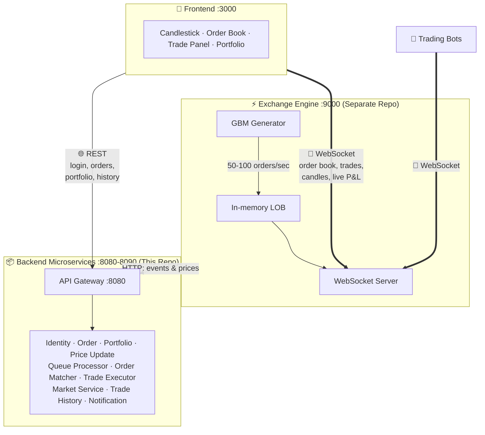
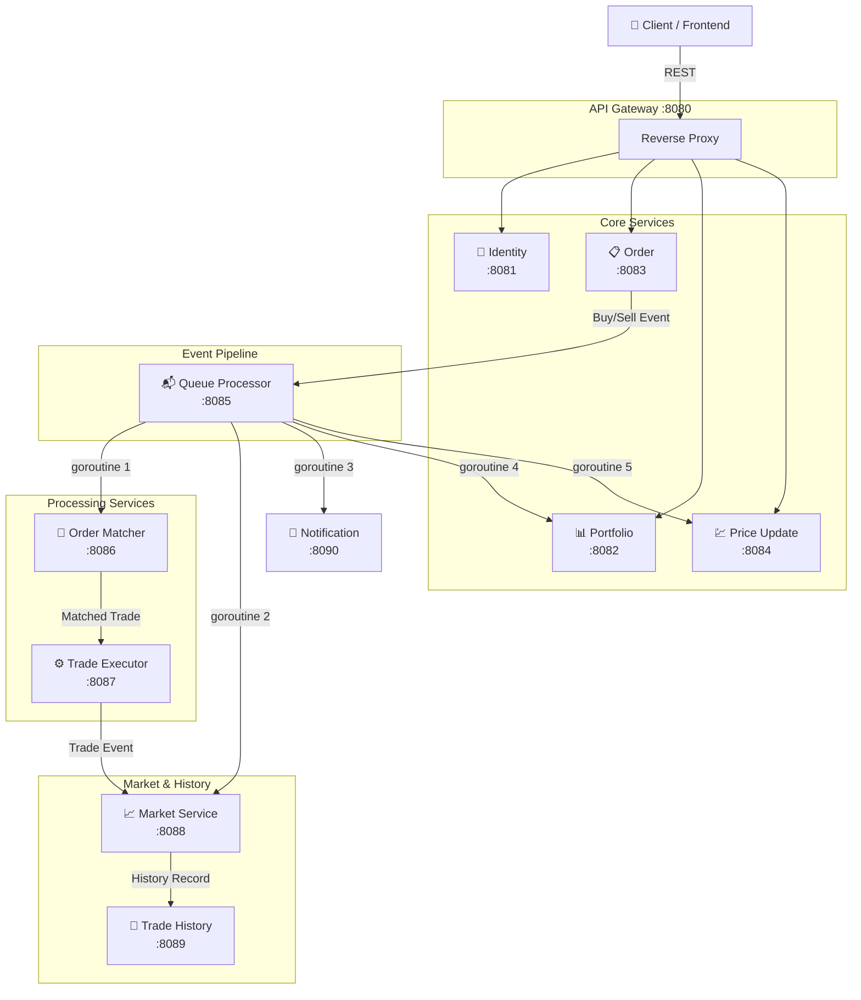

# 🐂 Project Synthetic-Bull — Backend Microservices

A distributed, event-driven backend system for a real-time stock exchange simulator. Built entirely in **Go** using **Gin** (HTTP), **GORM** (ORM), and **MySQL**, following a microservices architecture with 11 independently deployable services.

---

## 🔌 System Connection Architecture (Option 1 — Dual Connection)

The frontend connects to **two separate endpoints**: WebSocket for real-time data, REST for CRUD operations.



```
┌──────────────────────────────────────────────────────────┐
│                    FRONTEND (React)                       │
│                                                           │
│  Connection 1 (WebSocket)      Connection 2 (REST/HTTP)   │
│  ws://localhost:9000/ws        http://localhost:8080/api   │
│                                                           │
│  ✓ Order book updates          ✓ POST login/register      │
│  ✓ Trade executions            ✓ POST buy/sell orders      │
│  ✓ Candlestick data (1s/5s)    ✓ GET portfolio             │
│  ✓ Live P&L updates            ✓ GET trade history          │
│  ✓ Price ticks                 ✓ GET notifications          │
│                                                           │
│  → Exchange Engine (:9000)     → API Gateway (:8080)      │
│    (separate repo)               (this repo)              │
└──────────────────────────────────────────────────────────┘
```

---

## 📖 Theoretical Overview

### System Philosophy

The backend is designed as a **choreography-based microservice architecture** where services communicate through HTTP events rather than a central orchestrator. Each service owns its own database (Database-per-Service pattern) and exposes a focused REST API.

The system follows an **event-driven pipeline** model:

1. **User Request** → A user submits a Buy/Sell order through the API Gateway
2. **Order Placement** → The Order Service validates and persists the order, then emits an event to the Queue Processor
3. **Event Fan-out** → The Queue Processor acts as a lightweight event bus, dispatching the order event to **5 downstream services** simultaneously using Go's goroutines and `sync.WaitGroup`
4. **Order Matching** → The Order Matcher implements a **Price-Time Priority** algorithm — it matches incoming orders against the opposite side of the book (lowest asks for buys, highest bids for sells), supporting partial fills
5. **Trade Execution** → Matched orders become trades, recorded by the Trade Executor and forwarded to the Market Service
6. **Market Data** → The Market Service computes **OHLCV** (Open/High/Low/Close/Volume) summaries and feeds data to the Trade History service
7. **Portfolio & Price Updates** → The Portfolio Service recalculates holdings and average buy prices; the Price Update Service tracks price changes via CDC (Change Data Capture) and computes aggregated change data
8. **Notifications** → Every order event triggers a user notification with read/unread tracking

### Key Design Patterns

| Pattern | Implementation |
|---|---|
| **API Gateway** | Gin-based reverse proxy forwarding to 4 downstream services |
| **Database per Service** | Each service manages its own MySQL schema |
| **Event-Driven** | Queue Processor fans out events using goroutines |
| **Shared Auth** | JWT tokens validated independently by each service using a shared secret key (stateless) |
| **Price-Time Priority** | Order Matcher sorts by best price first, then earliest timestamp |
| **CQRS-like** | Writes go through the event pipeline; reads are direct to each service |

### Tech Stack

| Layer | Technology |
|---|---|
| Language | Go 1.22 |
| HTTP Framework | Gin |
| ORM | GORM |
| Database | MySQL |
| Auth | golang-jwt/jwt + bcrypt |
| Async | goroutines + sync.WaitGroup |
| Config | godotenv |
| Inter-service | HTTP (REST) via net/http |

---

## 🏗️ Architecture Diagram



### Service Communication Flow

```
User Request
    │
    ▼
API Gateway (:8080)
    │
    ├── GET /api/identity/* ──→ Identity Service (:8081)
    ├── GET /api/portfolio/* ──→ Portfolio Service (:8082)
    ├── POST /api/orders/*  ──→ Order Service (:8083)
    └── GET /api/prices/*   ──→ Price Update Service (:8084)
                                      │
                                      ▼
                    ┌──────── Queue Processor (:8085) ────────┐
                    │         (goroutine fan-out)              │
                    ▼              ▼         ▼          ▼     ▼
            Order Matcher    Market    Notification  Portfolio  Price Update
              (:8086)       (:8088)     (:8090)     (:8082)    (:8084)
                    │                                 [update]  [CDC]
                    ▼
            Trade Executor (:8087)
                    │
                    ▼
            Market Service (:8088) ──→ Trade History (:8089)
```

---

## 📦 Service Directory

| # | Service | Port | Database | Endpoints | Responsibility |
|---|---|---|---|---|---|
| 1 | `api-gateway` | 8080 | — | Proxy: `/api/*` | Reverse proxy, CORS, routing |
| 2 | `identity-service` | 8081 | `stockbroker_identity` | `/register`, `/login`, `/me` | User registration, JWT auth, profiles |
| 3 | `portfolio-service` | 8082 | `stockbroker_portfolio` | `/portfolio`, `/update`, `/transactions` | Holdings, avg buy price, P&L |
| 4 | `order-service` | 8083 | `stockbroker_orders` | `/buy`, `/sell`, `/orders` | Order CRUD, dispatches to Queue |
| 5 | `price-update-service` | 8084 | `stockbroker_prices` | `/companies`, `/price`, `/cdc` | Company data, price changes, CDC |
| 6 | `queue-processor` | 8085 | `stockbroker_queue` | `/buy`, `/sell`, `/events` | Event fan-out to 5 targets |
| 7 | `order-matcher` | 8086 | `stockbroker_matcher` | `/match`, `/book/:symbol` | Price-Time priority matching |
| 8 | `trade-executor` | 8087 | `stockbroker_trades` | `/execute`, `/trades` | Trade recording & settlement |
| 9 | `market-service` | 8088 | `stockbroker_market` | `/trade-event`, `/feed`, `/summary` | OHLCV, market feed |
| 10 | `trade-history` | 8089 | `stockbroker_history` | `/record`, `/history` | Persistent trade history |
| 11 | `notification-service` | 8090 | `stockbroker_notifications` | `/notify`, `/notifications/:user_id` | User alerts, read/unread |

---

## 🚀 Quick Start

```bash
# Start any service (Go must be installed)
cd Backend/<service-name>
go mod tidy
go run main.go
```

Each service reads its `.env` file for configuration. Update `DATABASE_URL` and `JWT_SECRET_KEY` as needed.

---

## 🔮 Future Implementations & Integrations

### 1. Exchange Engine (Separate Repo)

The core exchange engine will be built as a **separate, high-performance Go binary** containing:

| Component | Description |
|---|---|
| **In-memory LOB** | Limit Order Book with strict Price-Time priority |
| **GBM Market Generator** | Synthetic price generation using `St = S0·exp((μ-σ²/2)t + σWt)`, pushing 50-100 orders/sec |
| **WebSocket Server** | Real-time broadcast of order book updates, trade executions, and candlestick data |
| **Portfolio Tracker** | In-memory $100K starting capital per user with live P&L |

**Integration points:**
- Exchange Engine → Queue Processor (:8085) via HTTP (trade events)
- Exchange Engine → Price Update (:8084) via HTTP (GBM price feed)
- Exchange Engine → Portfolio (:8082) via HTTP (balance sync)
- Exchange Engine → Frontend via WebSocket (real-time data)

### 2. Frontend (Separate Repo — React)

| Component | Description |
|---|---|
| Live Candlestick Chart | 1s/5s intervals via WebSocket |
| Order Book Depth | Visual bid/ask spread |
| Trade Panel | Market & Limit order submission |
| Portfolio Widget | Cash, holdings, live P&L |

### 3. Trading Bots (Optional)

| Bot | Strategy |
|---|---|
| Market Maker | Provides liquidity with bid/ask spread around mid-price |
| Alpha Bot | Directional trading using Moving Average Crossover / RSI |

### 4. Infrastructure Enhancements

| Enhancement | Description |
|---|---|
| **Docker Compose** | Single `docker-compose up` to launch all services + MySQL |
| **Kafka/RabbitMQ** | Replace HTTP fan-out with message broker for true async |
| **WebSocket** | Add WebSocket support to API Gateway for real-time streaming |
| **Redis** | Caching layer for order book and price data |
| **MongoDB** | NoSQL store for Trade History (high write throughput) |
| **Debezium** | CDC connector for database change streaming |
| **gRPC** | Replace inter-service HTTP with gRPC for lower latency |

---

## 📁 Project Structure

```
Backend/
├── api-gateway/            # Reverse proxy (Gin)
├── identity-service/       # Auth + user management (JWT + bcrypt)
├── portfolio-service/      # Holdings + transactions
├── order-service/          # Order placement + queue dispatch
├── price-update-service/   # Company data + CDC
├── queue-processor/        # Event fan-out (goroutines)
├── order-matcher/          # Price-Time priority matching
├── trade-executor/         # Trade recording
├── market-service/         # OHLCV summaries + market feed
├── trade-history/          # Persistent history log
├── notification-service/   # User notifications
└── README.md               # ← You are here
```

Each service follows the same Go layout:
```
service-name/
├── go.mod                  # Go module
├── .env                    # Environment config
├── main.go                 # Entry point (Gin server)
├── config/config.go        # Settings loader
├── database/db.go          # GORM connection
├── models/*.go             # Database models
├── auth/jwt.go             # JWT middleware (where applicable)
└── handlers/*.go           # Route handlers
```

---

> Built for the **NEXTBULL × IIT Kharagpur Open Soft Competition 2026**
